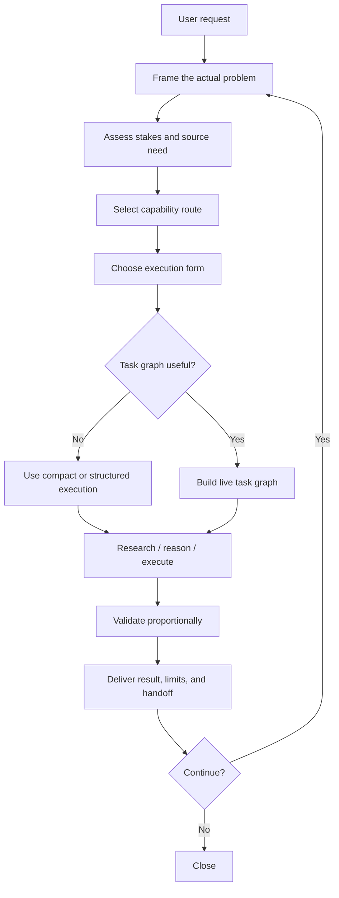
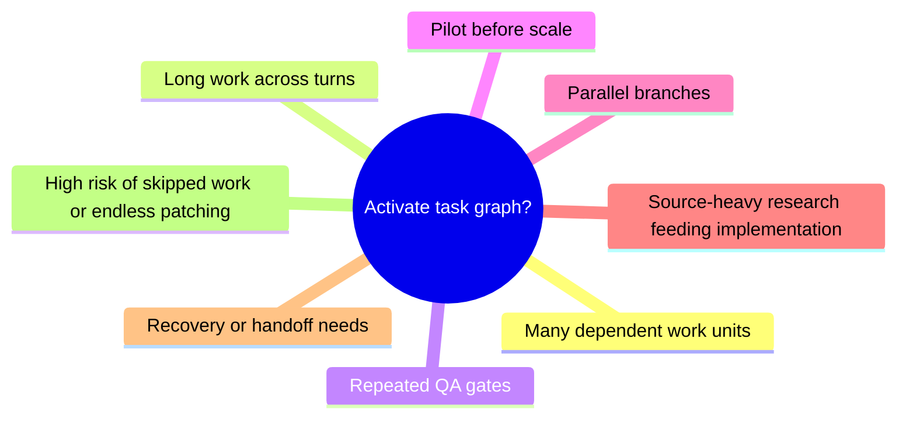

# General Problem Solver

**General Problem Solver** is an open framework for serious AI-assisted problem solving.

It is designed for work where shallow prompting is not enough: research synthesis, software implementation, artifact production, audits, course creation, reasoning-heavy analysis, multi-step debugging, framework maintenance, and long workflows that need validation and continuation.

The framework package is also called **GPSIF**: **General Problem Solver Intelligence Framework**.

> Core principle: **use the lightest execution form that still preserves reasoning quality, source discipline, validation, and trustworthy conclusions.**

---

## Why this exists

Most AI workflows fail in predictable ways:

- they answer before framing the problem;
- they search without source quality discipline;
- they over-plan but under-execute;
- they produce artifacts without validating them;
- they lose state across long work;
- they treat every task the same;
- they hide uncertainty instead of managing it.

GPSIF exists to make capable AI agents behave more like careful problem solvers: frame the task, choose the right execution form, use sources responsibly, execute in bounded units, validate proportionally, and hand off honestly.

---

## Agent prerequisite

GPSIF is not meant to magically turn a weak model into a world-class problem solver.

Recommended baseline:

> Use GPSIF with an intelligent AI agent that can **reason, plan, research, use tools/files, revise, validate, and state uncertainty honestly**.

Practical baseline examples:

- ChatGPT 5-class reasoning capability;
- Claude Sonnet-class reasoning capability;
- another modern agent with comparable reasoning, long-context, retrieval/tool-use, and validation ability.

The repository still includes a **low-capability / constrained-agent route**, but that route is a safety-compressed operating mode for simpler or restricted execution. For serious work, the recommended default is the advanced route.

Read more: `docs/AGENT_PREREQUISITES.md`

---

## What GPSIF gives an agent

| Capability | What it means in practice |
|---|---|
| Problem framing | Identify the actual goal, output, constraints, stakes, uncertainty, and hidden dependencies. |
| Execution-form selection | Choose compact answer, structured workflow, research synthesis, artifact workflow, task graph, or hybrid. |
| Source discipline | Use primary/current sources where needed, triangulate disputed claims, separate fact from inference. |
| Capability profiles | Load only the domain guidance that materially changes method, evidence, risk, validation, or handoff. |
| Task-graph orchestration | Track dependent work units, repeated QA gates, continuation, parallel branches, recovery, and handoff. |
| Validation and QA | Check outputs proportionally: tests, source cross-checks, artifact inspection, semantic review, adversarial QA. |
| Honest limits | Say what was validated, what was assumed, what remains uncertain, and what should happen next. |

---

## How it works



See the full architecture map: `docs/ARCHITECTURE.md`

---

## Start here

### For humans

Read:

1. `docs/QUICKSTART.md`
2. `human_ref/HUMAN_FRIENDLY_FRAMEWORK_REFERENCE.md`
3. `docs/ARCHITECTURE.md`

### For low-capability or constrained agents

Load:

1. `machine_ref/MACHINE_MINIMUM_RUNTIME.md`
2. `machine_ref/GPSIF_MACHINE_CONTRACT.yaml`
3. `machine_ref/GPSIF_AI_AGENT_CONDENSED_RUNTIME.md`

### For advanced agents

Load:

1. `machine_ref/ADVANCED_AGENT_STRUCTURED_RUNTIME.md`
2. `machine_ref/ADVANCED_PROFILE_CATALOG.json`
3. `machine_ref/ADVANCED_CANONICAL_OBLIGATION_MATRIX.json`
4. `machine_ref/GPSIF_MACHINE_CONTRACT.yaml`
5. Selected canonical files only when exact wording, audit, or maintenance requires them.

### For long or dependent work

Add:

1. `00_TASK_GRAPH_ROUTE.md`
2. `embedded_expert_packs/task_graph_orchestration/GPSIF_Task_Graph_Operational_Kernel.md`

---

## When to activate task graph

Use task-graph orchestration when the work has one or more of these properties:



Do **not** use a graph merely because the framework contains a graph system. GPSIF should reduce confusion, not add ceremony.

---

## Repository map

| Path | Purpose |
|---|---|
| `00_START_HERE.md` | Capability-profiled framework entrypoint. |
| `machine_ref/` | Primary machine-consumable runtime layer for agents. |
| `human_ref/` | Human-friendly reference and source map. |
| `core/` | Canonical framework standards. |
| `profiles/` | Domain profiles for different problem families. |
| `capability_profiles/` | Human, low-agent, and advanced-agent routes. |
| `embedded_expert_packs/` | Optional specialist methods, including task graph orchestration. |
| `schemas/` | Machine-readable contracts and registries. |
| `templates/` | Reusable templates for reports, validation, handoff, and artifacts. |
| `tools/` | Framework validators. |
| `meta_tests/` | Release contract and semantic testing support. |
| `docs/` | Public repo docs, architecture diagrams, prerequisites, launch notes, benchmarks. |

---

## Good uses

GPSIF is especially useful for:

- deep research answers;
- code architecture, implementation, and QA;
- technical course or learning-product creation;
- document, spreadsheet, slide, or PDF artifact workflows;
- ServiceNow-like enterprise platform analysis;
- academic writing and methodology design;
- product research and purchase decisions;
- software debugging and operational diagnosis;
- adversarial review and correctness passes;
- long-running “continue / next” workflows.

---

## Not a silver bullet

GPSIF does not replace model capability, tool access, factual checking, user judgment, or domain expertise. It improves agent behavior only when the executing agent can understand and follow the framework.

The framework should be treated as:

- a reasoning and execution scaffold;
- a validation and source-discipline standard;
- a task orchestration layer for serious workflows;
- a public framework that should be tested, challenged, and improved.

---

## Validation

From the repository root:

```bash
python meta_tests/run_release_contract.py --root . --json-out QA_RELEASE_CONTRACT_v2.4.16.json
python tools/gpsif_validate.py . --mode framework --strict
sha256sum -c SHA256SUMS.txt
```

Current public-repo package verification is recorded in `docs/repo/PUBLIC_REPO_READINESS_REPORT.md`.

---

## Open-source status and license

This package is prepared for public release, but a legal license still needs to be selected by the repository owner.

Read: `docs/repo/LICENSE_DECISION_GUIDE.md`

Until a license is added, public visibility does not automatically grant reuse rights. Choose a license before announcing the framework as open source.

---

## Contributing

Contributions are welcome when they improve practical problem-solving quality.

Start with:

- `CONTRIBUTING.md`
- `docs/benchmarks/BEHAVIORAL_BENCHMARK_PLAN.md`
- `docs/repo/REPOSITORY_LAUNCH_GUIDE.md`

Good contributions include clearer runtimes, better behavioral tests, examples, validation cases, profile improvements, and evidence-backed simplification.

---

## One-line positioning

**GPSIF is an open, capability-profiled, research-backed problem-solving framework for capable AI agents that need to do serious work with evidence, validation, and continuity.**
