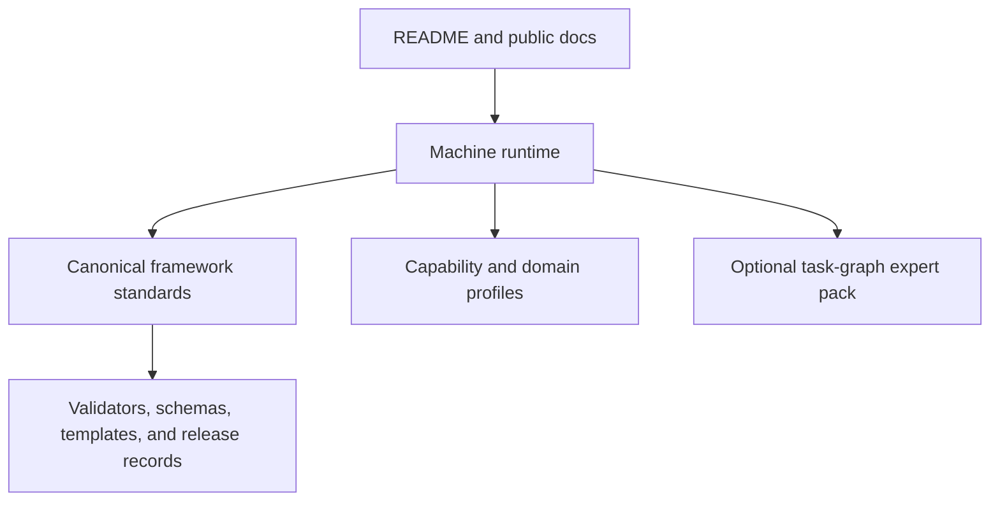

# Architecture

GPSIF has three public layers.

## Public layer

The public layer explains what the framework is, who should use it, and how to start.

## Machine runtime layer

The runtime layer gives agents compact operating rules so they do not need to load every canonical file for ordinary use.

## Canonical framework layer

The canonical layer contains the full standards, profiles, schemas, templates, QA records, and release contract material.

## Design rule

Use the lightest execution form that still preserves rigor, evidence, validation, and trustworthy conclusions.
